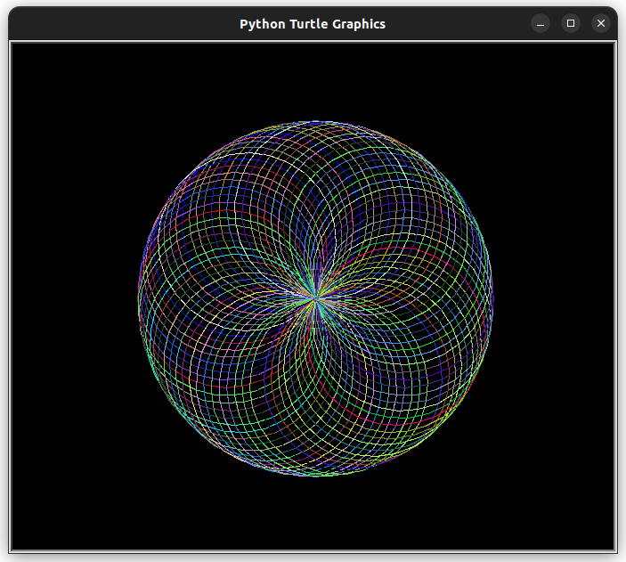

# Draw Spirograph using Python

Tejas [twitter](https://twitter.com/achte_te)

Using Python to draw a Spirograph.

### Requirements:
[Turtle](https://docs.python.org/3/library/turtle.html)


To Run:

```sh
git clone git@github.com:achte-2022/Spirograph.git
cd Spirograph
python3 main.py
```

### Output Image:

